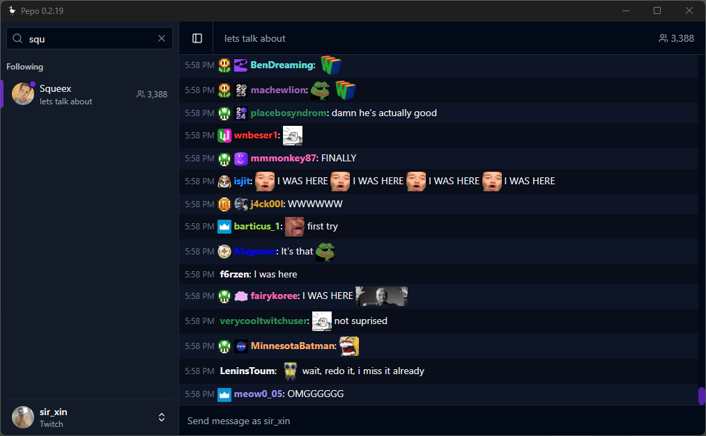

<p align="center">
  <a href="https://pepo.chat"></a>
</p>

<span align="center">

# A new way to chat

This is a playground of a new chatting client. It currently only supports twitch, but the goal is to expand support for other sites such as youtube, etc. It is very very early in development.

<p align="center">
  
</p>

</span>

## Status

- [x] Sending messages
- [x] Message parsing with badges, emotes, and colored usernames
- [x] Third-party emote support (7TV, BTTV, FFZ)
- [x] Followed channels sidebar with live status
- [x] Auto-updater
- [ ] Message history
- [ ] Moderation tools
- [ ] YouTube support

## Goals

Right now when it comes to chatting on live content sites, the usablity and features of the different site chats vary wildly. When watching on Twitch you have some options for improving this experience with extension such as FFZ, BTTV, and 7tv, but as of now that's limited to the browser. Chatterino is a great desktop client, that can be injected into the browser. However, it's pretty much the sole option.

This was mostly born out of a want for myself. I wanted a clean chatting UI that was consistent across web, desktop, and mobile. We'll see if I can actually accomplish that.

It has already gone through one major overhaul, which you can go back and see the code [here](https://github.com/synthlabs/pepo/tree/32684c0062f028fd0a2960288cca50075bd40af1) and what it looked like [here](https://github.com/synthlabs/pepo/blob/32684c0062f028fd0a2960288cca50075bd40af1/screenshots/Pepo_gKoTqlm5h1.gif)

## Install

Download the latest release for your platform from the [GitHub Releases](https://github.com/synthlabs/pepo/releases/latest) page.

| Platform              | File                        |
| --------------------- | --------------------------- |
| macOS                 | `Pepo_x.x.x_universal.dmg`  |
| Windows               | `Pepo_x.x.x_x64-setup.exe`  |
| Linux (Debian/Ubuntu) | `Pepo_x.x.x_amd64.deb`      |
| Linux (Fedora/RHEL)   | `Pepo-x.x.x-1.x86_64.rpm`   |
| Linux (AppImage)      | `Pepo_x.x.x_amd64.AppImage` |

Once installed, Pepo will notify you when updates are available and can update itself in-place.

### Build from Source

Requires [Rust](https://www.rust-lang.org/tools/install), [Node.js](https://nodejs.org/), and [pnpm](https://pnpm.io/).

```bash
git clone --recurse-submodules https://github.com/synthlabs/pepo.git
cd pepo
pnpm install
pnpm tauri build
```

The built application will be in `src-tauri/target/release/bundle/`.
